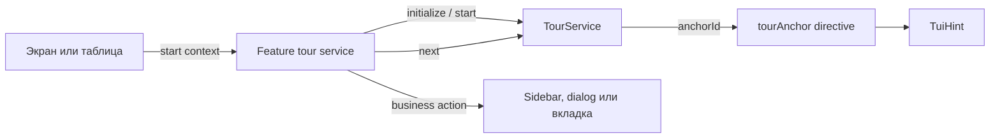
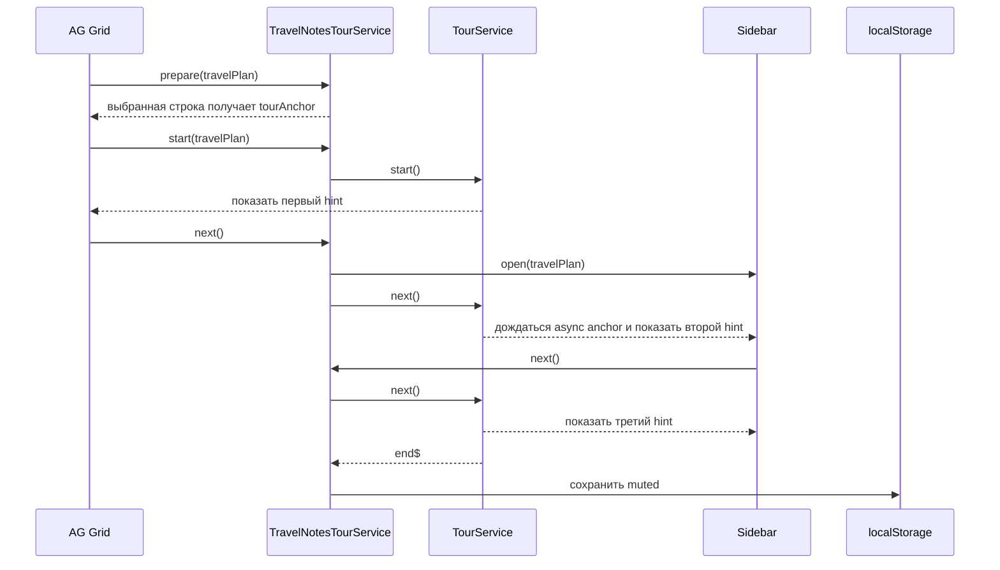

# AG Grid + Taiga UI onboarding with ngx-ui-tour

Учебный прототип трехшагового онбординга для AG Grid и правого сайдбара заметок. Демонстрационный сценарий построен вокруг планирования путешествий и не привязан к реальному корпоративному продукту.

Навигация, регистрация anchors, backdrop, hotkeys и жизненный цикл тура реализованы библиотекой [`ngx-ui-tour-tui-hint`](https://hakimio.github.io/ngx-ui-tour/tui-hint/Setup).

## Стек

- Angular 19.2.6;
- Taiga UI 4.69.0;
- AG Grid 34.2.0;
- `ngx-ui-tour-tui-hint` 8.0.0.

Версия `ngx-ui-tour-tui-hint` 8 совместима с Angular 19 и Taiga UI 4.

## Как устроено решение

Общую механику тура предоставляет библиотека. Feature-сервис хранит бизнес-контекст и связывает шаги с действиями приложения.

```text
ГДЕ показать    -> [tourAnchor] и anchorId
ЧТО показать    -> custom tour-step-template
В КАКОМ порядке -> массив IStepOption
ЧТО сделать     -> feature-сервис перед tour.next()
```



### Что делает библиотека

`ngx-ui-tour-tui-hint` берет на себя:

- хранение текущего шага;
- поиск anchor по `anchorId`;
- переходы между шагами;
- ожидание шагов с `isAsync`;
- позиционирование `TuiHint`;
- backdrop;
- блокировку прокрутки;
- события `start$`, `stepShow$`, `end$`;
- hotkeys и завершение тура.

### Что делает feature-сервис

`TravelNotesTourService` отвечает за сценарий заметок:

- описывает три шага;
- хранит выбранный `TravelPlanDto`;
- определяет, какая кнопка в AG Grid получает первый anchor;
- открывает sidebar перед переходом ко второму шагу;
- запускает и завершает `TourService`;
- сохраняет `muted` в `localStorage`.



## Основные части

### Идентификаторы anchors и шагов

Anchor и step имеют разные идентификаторы:

```ts
export const FEATURE_TOUR_ANCHORS = {
    trigger: 'feature-trigger',
    details: 'feature-details',
} as const;

export const FEATURE_TOUR_STEPS = {
    trigger: 'feature-trigger-step',
    details: 'feature-details-step',
} as const;
```

- `anchorId` указывает, возле какого DOM-элемента показать hint;
- `stepId` идентифицирует сам шаг и помогает выполнять feature-логику в `next()`.

### Описание последовательности

```ts
const STEPS: IStepOption[] = [
    {
        stepId: FEATURE_TOUR_STEPS.trigger,
        anchorId: FEATURE_TOUR_ANCHORS.trigger,
        placement: 'right',
        enableBackdrop: true,
    },
    {
        stepId: FEATURE_TOUR_STEPS.details,
        anchorId: FEATURE_TOUR_ANCHORS.details,
        placement: 'left',
        enableBackdrop: true,
        isAsync: true,
    },
];
```

`isAsync: true` нужен, когда anchor еще не существует на момент запуска тура, например находится внутри sidebar, dialog или лениво созданной вкладки.

### Инициализация

Feature-сервис инициализирует библиотеку один раз:

```ts
this.tour.initialize(STEPS, {
    disablePageScrolling: true,
    showProgress: false,
    stepDimensions: {
        width: 'min(29rem, calc(100vw - 1rem))',
        maxWidth: 'calc(100vw - 1rem)',
    },
});
```

### Custom template

`<tour-step-template>` позволяет заменить стандартное содержимое шага собственным Angular-компонентом.

```html
<tour-step-template>
    <ng-template let-step="step">
        <feature-tour-template [step]="step" />
    </ng-template>
</tour-step-template>
```

Компонент template получает текущий `IStepOption` и по `stepId` показывает нужный заголовок, preview и кнопку.

## Как добавить свой тур

### 1. Подключите модуль библиотеки

Компонент верхнего уровня должен импортировать `TourTuiHintModule` и содержать `<tour-step-template>`.

```ts
@Component({
    imports: [TourTuiHintModule, FeatureTourTemplateComponent],
    providers: [provideFeatureTour()],
})
export class FeaturePageComponent {}
```

### 2. Опишите anchors и шаги

```ts
export const FEATURE_TOUR_ANCHORS = {
    trigger: 'feature-trigger',
    tabs: 'feature-tabs',
    action: 'feature-action',
} as const;

export const FEATURE_TOUR_STEPS = {
    trigger: 'feature-trigger-step',
    tabs: 'feature-tabs-step',
    action: 'feature-action-step',
} as const;
```

Создайте массив `IStepOption[]` в правильном порядке. Для anchors, которые появятся позже, добавьте `isAsync: true`.

### 3. Создайте feature-сервис

```ts
@Injectable()
export class FeatureTourService {
    private readonly localStorage = inject(WA_LOCAL_STORAGE);
    private readonly tour = inject(TourService);
    private readonly target = signal<Entity | null>(null);

    public constructor() {
        this.tour.initialize(STEPS, {
            disablePageScrolling: true,
            showProgress: false,
        });

        this.tour.end$
            .pipe(takeUntilDestroyed(inject(DestroyRef)))
            .subscribe(() => {
                this.localStorage.setItem('@onboarding.feature-name.v1', 'muted');
            });
    }

    public prepare(entity: Entity): void {
        this.target.set(entity);
    }

    public start(entity: Entity): boolean {
        if (this.localStorage.getItem('@onboarding.feature-name.v1') === 'muted') {
            return false;
        }

        this.target.set(entity);
        this.tour.start();

        return true;
    }

    public isTarget(entity: Entity): boolean {
        return this.target()?.id === entity.id;
    }

    public next(): void {
        if (this.tour.currentStep?.stepId === FEATURE_TOUR_STEPS.trigger) {
            const entity = this.target();

            if (entity) {
                this.openSidebar(entity);
            }
        }

        this.tour.next();
    }

    private openSidebar(entity: Entity): void {
        // Бизнес-действие feature-слоя
    }
}
```

`prepare()` полезен для повторяющихся элементов: он заранее выбирает строку, которая должна зарегистрировать первый anchor, еще до вызова `tour.start()`.

### 4. Добавьте anchors

Для единственного элемента:

```html
<div [tourAnchor]="anchors.tabs">
    Target второго шага
</div>
```

Для повторяющихся элементов только выбранная строка должна получить `anchorId`:

```html
<button
    [tourAnchor]="featureTour?.isTarget(entity) ? anchors.trigger : ''"
    type="button"
>
    Открыть
</button>
```

Пустая строка означает, что directive не регистрирует anchor для этой строки.

### 5. Добавьте custom template

```ts
@Component({
    selector: 'feature-tour-template',
    template: `
        @switch (step().stepId) {
            @case (steps.trigger) {
                <h3>Первый шаг</h3>
            }
            @case (steps.tabs) {
                <h3>Второй шаг</h3>
            }
        }

        <button type="button" (click)="featureTour.next()">
            Далее
        </button>
    `,
})
export class FeatureTourTemplateComponent {
    protected readonly featureTour = inject(FEATURE_TOUR);
    protected readonly steps = FEATURE_TOUR_STEPS;

    public readonly step = input.required<IStepOption>();
}
```

Для последнего шага вызовите `tour.end()` вместо `next()`.

### 6. Запускайте после подготовки первого anchor

Для обычного компонента target должен существовать в DOM. Для AG Grid также нужно показать колонку и привести строку в viewport.

```text
выбрать entity
-> prepare(entity)
-> дождаться renderer
-> показать колонку
-> привести строку в viewport
-> start(entity)
```

В демо `prepare()` вызывается заранее, а `start()` запускается после `firstDataRendered`.

### 7. Подключите feature flag

Provider возвращает feature-сервис или `null`:

```ts
export const FEATURE_TOUR = new InjectionToken<FeatureTourService | null>(
    '[FEATURE_TOUR]: FeatureTourService',
);

export function provideFeatureTour(): Provider {
    return [
        FeatureTourService,
        {
            provide: FEATURE_TOUR,
            useFactory: () =>
                inject(APP_CONFIG).features?.enableOnboarding
                    ? inject(FeatureTourService)
                    : null,
        },
    ];
}
```

При выключенном флаге `[tourAnchor]` должен получить пустую строку.

## Важные особенности

### `isAsync` не открывает интерфейс

Библиотека может дождаться регистрации anchor, но sidebar, dialog или вкладку должен открыть feature-сервис.

Правильный порядок:

```text
feature action
-> DOM следующего anchor создается
-> tour.next()
-> библиотека показывает следующий шаг
```

### DOM-порядок не выбирает бизнес-target

Для виртуализированной таблицы feature-сервис явно хранит выбранную entity. Не следует назначать один `anchorId` всем строкам и надеяться, что библиотека выберет нужную.

### Завершение и `localStorage`

В демо `tour.end$` записывает:

```text
@onboarding.travel-notes.v1 = muted
```

Чтобы показать значительно измененный тур повторно, увеличьте версию ключа. Для локальной проверки удалите ключ вручную.

### Закрытие feature UI

Если пользователь закрывает sidebar во время активного тура, завершите `TourService`, чтобы hint не остался привязанным к уничтоженному anchor.

```ts
if (this.tour.currentStep) {
    this.tour.end();
}
```

## Частые проблемы

### Первый hint не появился

Проверьте:

- `tour.initialize()` был вызван;
- первый `anchorId` зарегистрирован в DOM;
- выбранный renderer получил непустой `[tourAnchor]`;
- колонка видима;
- строка находится в viewport;
- muted-state отсутствует.

### Следующий async-шаг не появился

Проверьте:

- у шага указано `isAsync: true`;
- feature-сервис открыл sidebar или dialog;
- DOM содержит элемент с нужным `anchorId`;
- `tour.next()` вызывается после feature-действия.

### Нужно повторно проверить первый запуск

```js
localStorage.removeItem('@onboarding.travel-notes.v1');
location.reload();
```

## Runtime configuration

До bootstrap приложение загружает `src/config.json` и предоставляет конфигурацию через `APP_CONFIG`.

```json
{
  "features": {
    "enableOnboarding": true
  }
}
```

`provideTravelNotesTour()` предоставляет `TravelNotesTourService` при включенном флаге и `null` при выключенном.

## Локальный запуск

```bash
npm ci
npm start
```

Откройте `http://localhost:4200`.

Чтобы отключить онбординг, установите `enableOnboarding: false` в `src/config.json` и перезапустите приложение.

## Демонстрационный сценарий

1. Таблица содержит вымышленные маршруты, страны, сезоны, длительность и статус планирования.
2. Первый шаг привязан к иконке заметок выбранного маршрута.
3. `Далее` открывает sidebar и переводит библиотечный tour на второй шаг.
4. Второй шаг объясняет категории `Все`, `Подготовка` и `Впечатления`.
5. Третий шаг показывает, как добавить важную заметку в чек-лист подготовки.
6. Крестик или `Понятно` завершают tour и сохраняют muted-state.
7. Прозрачный backdrop блокирует интерфейс под текущим шагом.

## Production build

```bash
npm run build
```

Для GitHub Pages:

```bash
npm run build:pages
```

Результат находится в `dist/agrid-taiga-onboarding-ngx-tour/browser`.

CI устанавливает зависимости через `npm ci` с использованием закоммиченного `package-lock.json`.
